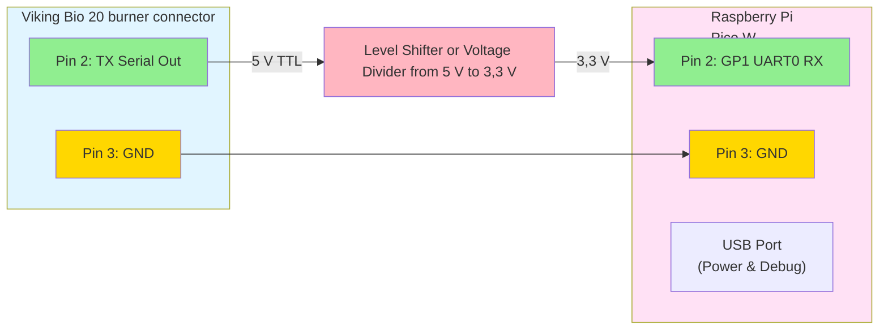

# Viking Bio PWA

A Progressive Web App (PWA) dashboard and Web Push notification system for the Viking Bio 20 pellet burner, running on a Raspberry Pi Pico W.

## Features

- **Real-time Dashboard**: Web-based dashboard showing live burner data (flame status, fan speed, temperature, error codes)
- **AJAX Polling**: Dashboard polls for data every 2 seconds via the lwIP httpd server
- **Web Push Notifications**: Browser push notifications when errors are detected
- **PWA**: Installable on mobile/desktop, works offline (cached service worker)
- **Viking Bio 20 Protocol**: Reads TTL serial data at 9600 baud from the burner's serial port
- **LittleFS Storage**: Wear-leveled flash storage for configuration (WiFi credentials, VAPID keys, country code)
- **Wi-Fi Country Setting**: Configurable Wi-Fi regulatory domain via USB serial

## Hardware

- Raspberry Pi Pico W
- Viking Bio 20 burner (TTL serial at 9600 baud, 8N1)
- Serial connection: UART0 (GPIO0=TX, GPIO1=RX)

## Wiring

Connect the Viking Bio 20 TTL serial output by RJ12 cable to the Raspberry Pi Pico W:


**Note**: The Pico W RX pin (GP1) expects 3,3&nbsp;V logic levels. The Viking Bio 20's TTL output voltage should be verified before connecting directly. If it outputs 5&nbsp;V TTL (which is common), a level shifter (e.g., bi-directional logic level converter) or voltage divider (two resistors: 2kΩ from TX to RX, 1kΩ from RX to GND) is required for safe voltage conversion. The diagram above shows the configuration with level shifting, which is the recommended safe approach.

## Architecture

```
Viking Bio 20 ──UART──► Pico W ──WiFi──► Browser
                          │
                    HTTP Server (lwIP httpd, port 80)
                    ├── GET /                  Dashboard PWA
                    ├── GET /sw.js             Service Worker
                    ├── GET /manifest.json     PWA Manifest
                    ├── GET /api/data          Burner data (JSON)
                    ├── GET /api/vapid-public-key  VAPID Key
                    ├── GET /api/country       Wi-Fi country code
                    ├── POST /api/subscribe    Push Subscription
                    ├── POST /api/unsubscribe  Remove Subscription
                    └── POST /api/country      Set Wi-Fi country
```

## Building

### Prerequisites

```bash
sudo apt-get install cmake gcc-arm-none-eabi libnewlib-arm-none-eabi build-essential

# Clone Pico SDK 2.2.0
git clone --depth 1 --branch 2.2.0 https://github.com/raspberrypi/pico-sdk.git
cd pico-sdk && git submodule update --init && cd ..

export PICO_SDK_PATH=$(pwd)/pico-sdk
```

### Build

```bash
mkdir build-pwa && cd build-pwa
cmake .. -DWIFI_SSID="your_network" -DWIFI_PASSWORD="your_password"
make -j$(nproc)
```

The firmware will be built as `viking_bio_pwa-<version>.uf2`.

LittleFS is fetched automatically via CMake FetchContent during configuration.

### Flash

Hold BOOTSEL while plugging in the Pico W, then copy the `.uf2` file to the mounted drive.

## Configuration

### USB Serial Commands

Connect via USB serial (115200 baud) to configure:

| Command | Description |
|---------|-------------|
| `SSID=<ssid>` | Set WiFi SSID (stage for saving) |
| `PASS=<password>` | Set password and save credentials (reboots) |
| `COUNTRY=<CC>` | Set Wi-Fi country code (e.g. SE, US, GB) |
| `STATUS` | Show WiFi status and current country |
| `CLEAR` | Erase stored credentials (reboots) |

### Wi-Fi Country

The Wi-Fi country code controls regulatory settings (available channels, transmit power). Set via:
- USB serial: `COUNTRY=SE`
- Web UI: Country selector dropdown on the dashboard
- Reboot required after changing country

## Web Push

1. Open the dashboard in a browser at `http://<pico-ip>/`
2. Click **Enable Push Notifications**
3. Accept the notification permission request
4. The browser is now registered for push notifications
5. When the Viking Bio 20 reports an error (non-zero error code), a push notification is sent

VAPID keys are generated on first boot and stored in LittleFS. They persist across reboots.

Notes on server/client integration and Web Push headers

- Subscription POST format: the dashboard posts a small JSON object to `POST /api/subscribe` with top-level fields `endpoint`, `p256dh`, and `auth` (all base64url where applicable). The server stores these values and uses them when sending notifications. The dashboard also includes an optional `prefs` object for client-side preferences.
- Authorization header: outgoing push requests use a VAPID JWT placed in the `Authorization` header as `Authorization: WebPush <jwt>` (the server generates the JWT at send time).
- Encrypted payload headers: when delivering encrypted notifications (`Content-Encoding: aes128gcm`) the server includes the required headers:
    - `Encryption: salt=<base64url-salt>`
    - `Crypto-Key: dh=<base64url-ephemeral-public>;p256ecdsa=<base64url-vapid-public>`
    These allow the push service and the browser to perform the EC Diffie-Hellman and derive the CEK/nonce per RFC 8291 / RFC 8188.
- Payload layout: the encrypted body uses the aes128gcm single-record layout. The wire format begins with the 16-byte salt followed by the Record Size field, id length, the ciphertext record, and a 16-byte auth tag. The service worker expects JSON when decrypted (the project's service worker tries to parse `e.data.json()` and falls back to a default payload).

The above details are implemented in the firmware: the dashboard sends subscriptions with `endpoint`, `p256dh`, and `auth`; the device generates/stores VAPID keys and includes the appropriate `Encryption` / `Crypto-Key` headers when sending encrypted push payloads.

## Data Format

The Viking Bio 20 protocol supports:

**Binary protocol**: `[0xAA] [FLAGS] [FAN_SPEED] [TEMP_HIGH] [TEMP_LOW] [0x55]`
- FLAGS bit 0: flame detected
- FLAGS bits 1-7: error code

**Text protocol**: `F:1,S:50,T:75` (Flame, Speed%, Temp°C)
